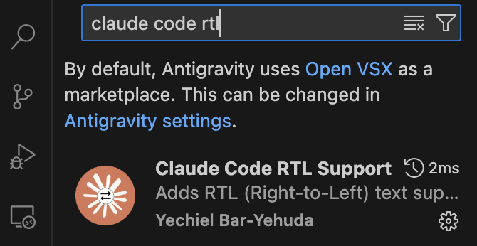
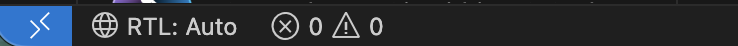
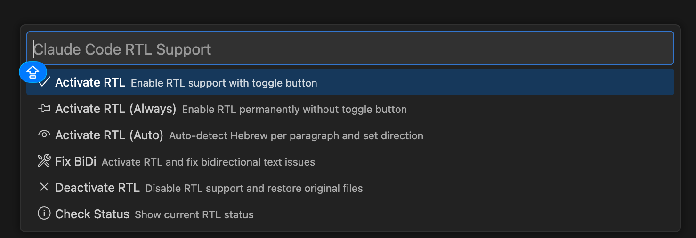

המדריך מתאים ל-VS Code (המומלץ אצלנו), וגם ל-Cursor, Antigravity או כל עורך אחר מבוסס VS Code — אותו תוסף, אותם שלבים.

## אופציה א': קלוד קוד

אם התקנתם את הסקילים מה-Skills Hub (מדריך ההתקנה), פשוט תכתבו לקלוד קוד:

```text
תתקין לי עברית
```

הסקיל `install-rtl-extension` יעשה את כל העבודה — התקנה, הסבר על ההפעלה מחדש והפעלת ה-RTL.

אם הסקיל לא מותקן אצלכם, תשלחו לקלוד את זה במקום:

```text
תתקין לי בבקשה את התוסף Claude Code RTL Support בעורך שלי. המזהה של התוסף: yechielby.claude-code-rtl
תריץ את הפקודה המתאימה לעורך בטרמינל:
ב-VS Code: code --install-extension yechielby.claude-code-rtl
ב-Cursor: cursor --install-extension yechielby.claude-code-rtl
ב-Antigravity: antigravity --install-extension yechielby.claude-code-rtl
```

## אופציה ב': ידנית

התקנת התוסף עברית RTL

לוחצים הכפתור של ה-4 ריבועים בסרגל בצד

לאחר מכן בחיפוש כותבים:

```text
Claude code rtl
```

*(צילומי המסך מ-Antigravity — ב-VS Code ו-Cursor המסכים זהים)*


מורידים את התוסף

לוחצים על הסרגל בצד שמאל למטה
על איפה שכתוב RTL



ובוחרים באפשרות השלישית - (Auto)




