## חיבור Meta Ads

חיבור חשבון המטא ל-Claude Code - שליפת נתוני קמפיינים ישירות מהטרמינל.

## יצירת אפליקציה של מפתח מטה

- נכנסים ל-developers.facebook.com/apps
- מתחברים עם החשבון פייסבוק:

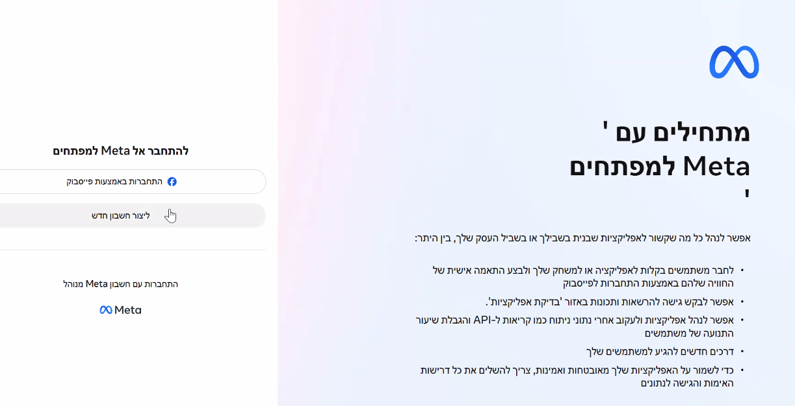

נרשמים בתור המפתחים של Meta

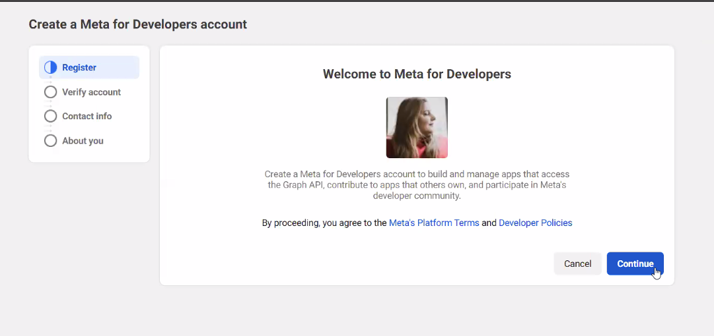

אחרי הזנת פרטים אישיים, בוחרים כאן Developer

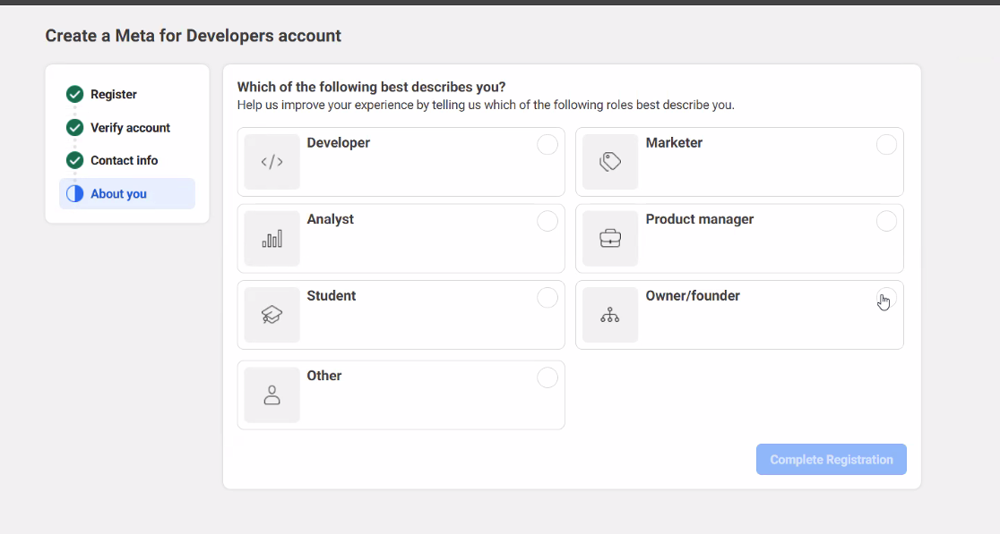

- לוחצים Create App

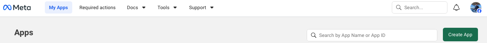

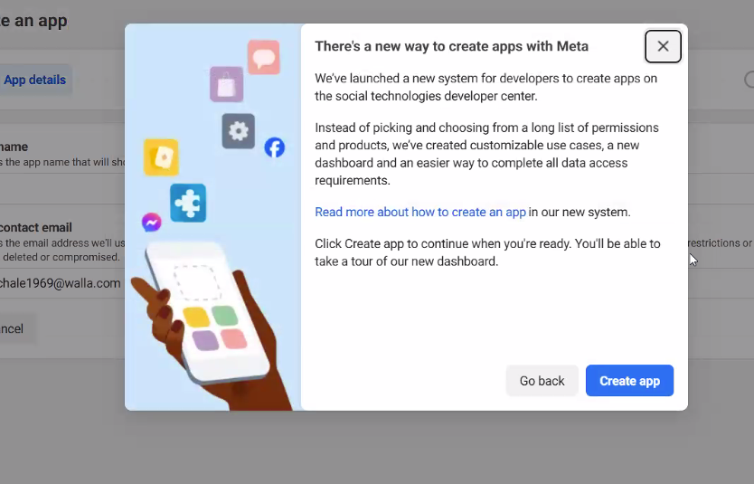

- שם: למשל Workshop

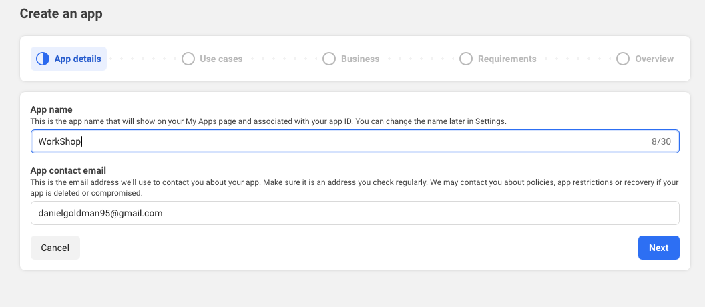

- בתפריט Use Cases בוחרים Create & manage ads

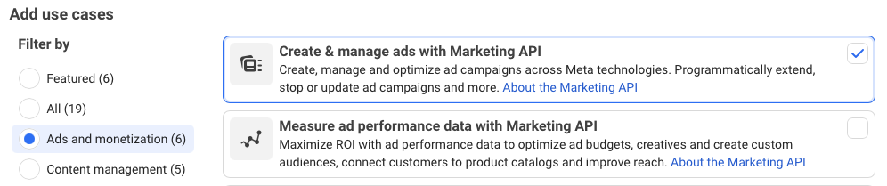

- מחברים את ה-Business Portfolio
- ממשיכים עם ההוראות של Meta
- יוצרים את האפליקציה

## הרשאות אפליקציה

לוחצים על Use Cases
ואז על Customize תחת ה-Instagram

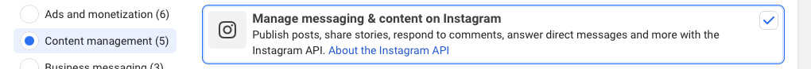

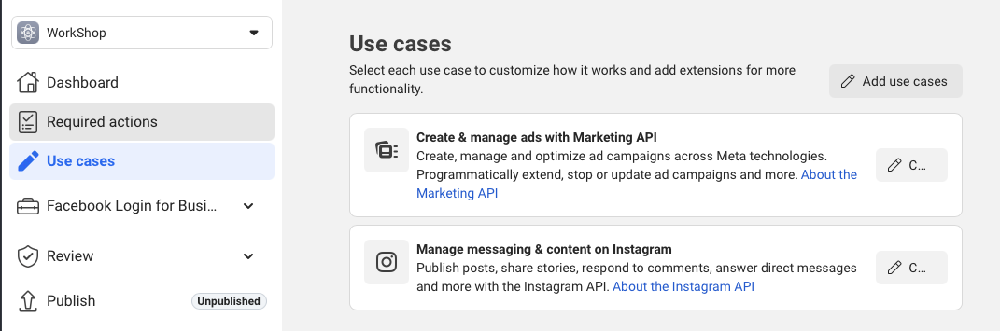

למי שבעברית אז "מקרי שימוש"

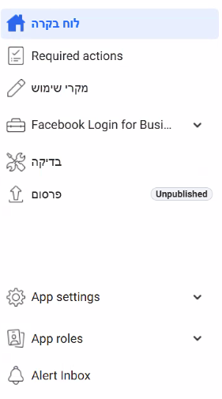

כאן לוחצים על API setup with Instagram Login

ואז על הכפתור הכחול Add all required permissions

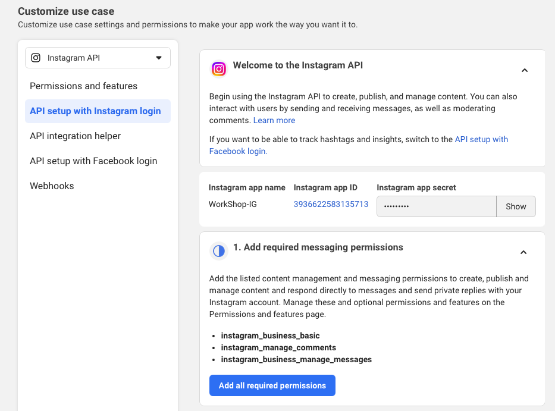

ואז לוחצים על

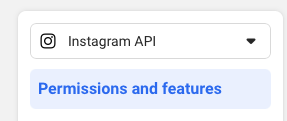

ומחפשים את:

instagram_basic
instagram_manage_insights

ולוחצים בניהם + Add to App

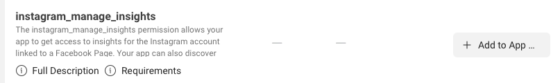

## יצירת Token

- נכנסים ל-developers.facebook.com/tools/explorer
- בתפריט Get Token:
  בוחרים Get Page Access Token

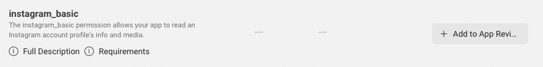

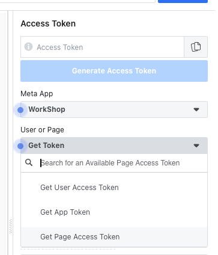

- לוחצים Generate token
- בוחרים את האפליקציה
- מסמנים:

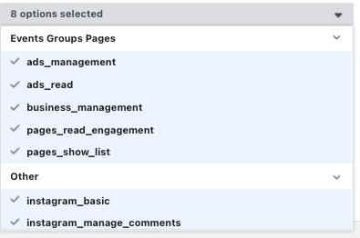

- לוחצים Generate Access Token

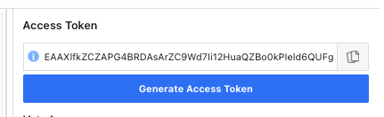

- מעתיקים את הטוקן!

## חיבור ל-Claude Code

כותבים לקלוד קוד (מחליפים YOUR_TOKEN בטוקן שלכם):

```text
חבר אותי לחשבון המטה באמצעות ה-mcp עם ה-token הזה: YOUR_TOKEN
```

## בדיקה

מפעילים מחדש את Claude Code ושואלים:

```text
תראה לי את החשבונות מודעות שלי
```

- אם מקבלים רשימת חשבונות - הכל עובד!

## קישור לדשבורד של יהב

<https://github.com/dangogit/ads-dashboard-template.git>
