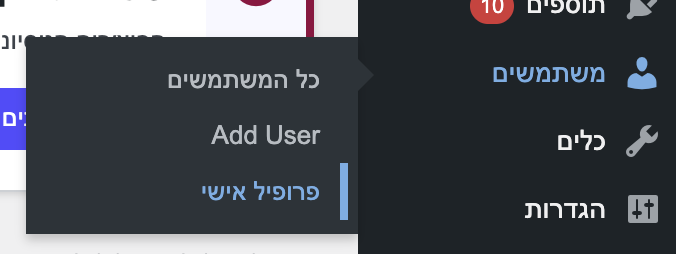
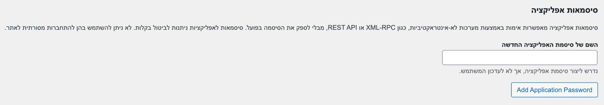
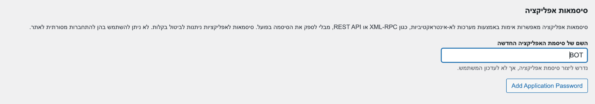
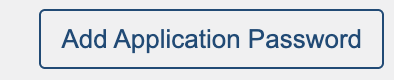
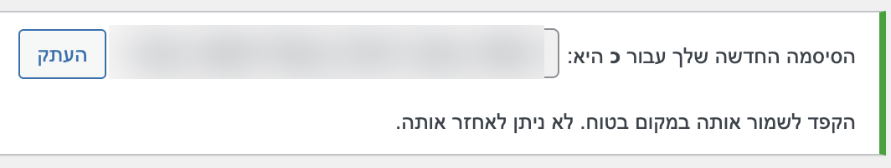
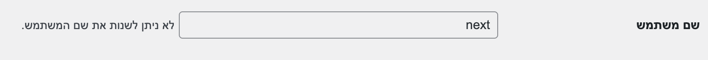

## חיבור האתר

1. נכנסים לוורדפרס, סרגל כלים בצד ימין לוחצים על - משתמשים > פרופיל אישי



2. גוללים למטה עד "סיסמאות אפליקציה"



3. בוחרים שם לאפליקציה -



4. ולוחצים על הכפתור: Add Application Password


5. מעתיקים את הקוד -



6. לאחר מכן - מעתיקים את השם משתמש של האתר (מופיע בחלק העליון ברקע אפור)



7. פותחים צ'אט עם קלוד וכותבים - ומדביקים את הקוד + השם משתמש של האתר וכותבים:

```text
תתחבר לי לאתר וורדפרס
```



## פקודות שאפשר לכתוב:

```text
תבנה לי אסטרטגיה SEO לפי הסקיל שיש לך.
```

```text
תעשה לי מחקר מילות מפתח לנישה שלי.
```

```text
תבנה לי אסטרטגיה להיות מקום ראשון בגוגל במילת מפתח [מילת מפתח פופולרית]
```

```text
תשפר לי את מהירות האתר.
```

```text
תכתוב לי בלוגים ומאמרים.
```

## אחרי שיש מאמרים מוכנים שאנחנו מרוצים מהם, אפשר להריץ משימות מתוזמנות:

```text
1. כל יום ב-7:00 תעשה מחקר על מה חדש בנישה שלי ותכתוב לי 2 מאמרים בנושא עם המילות מפתח שבחרנו ובצורה האידיאלית לקידום SEO.
```

```text
2. כל יום ב-15:00 תכתוב עוד מאמר מקיף (כמו מדריך) עם ערך פרקטי שיקדם את האתר שלי.
```

```text
3. כל שבוע - יום ראשון בשעה 10:00 תעבור על האתר ותוודא שאין באגים.
```

```text
4. כל שבוע - יום ראשון בשעה 11:00 תעשה עדכון לתוספים ותוודא שהכל עובד חלק בלי באגים.
```

```text
5. כל שבוע - יום ראשון בשעה 12:00 - תכתוב לי דוח מסודר של מה עשית וכמה התקדמנו השבוע למטרה שלנו.
```
