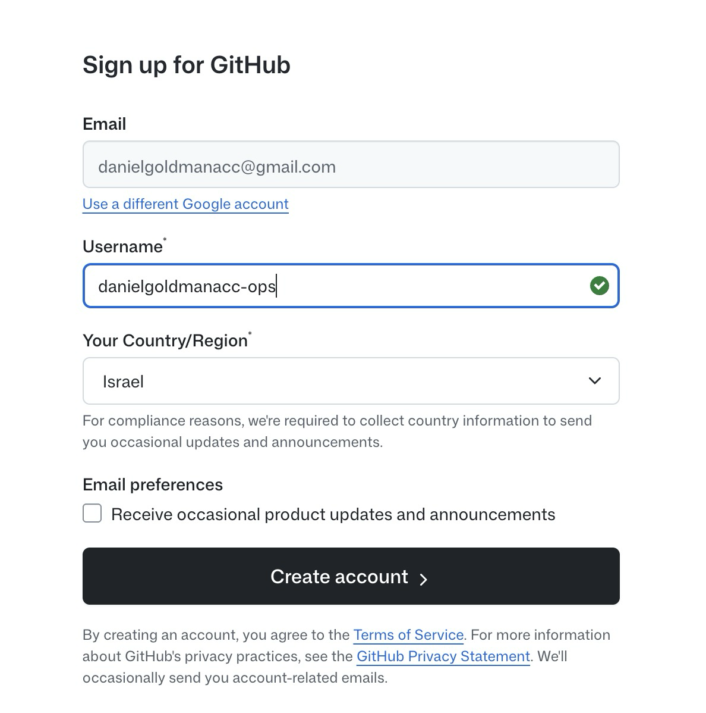

גיטהאב שומר את הקוד שלכם ומאפשר שיתוף ודיפלוי.

## הרשמה

- נכנסים ל-<https://github.com/signup>
- נרשמים עם ה-Google (מומלץ)


מגדירים את שם המשתמש שלכם:



## הגדרת Git

כותבים לקלוד קוד:

במקום `Your Name` ו-`your@email.com` מכניסים את הפרטים שלכם

```text
חבר אותי לגיט האב עם הפרטים שלי:
"Your Name"
"your@email.com"
```

- הדפדפן נפתח, מאשרים את החיבור
