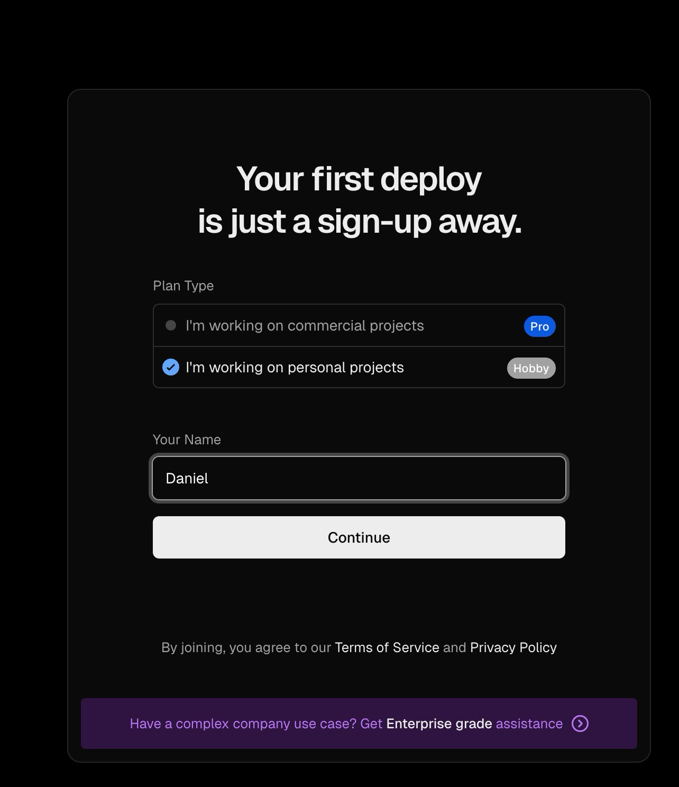
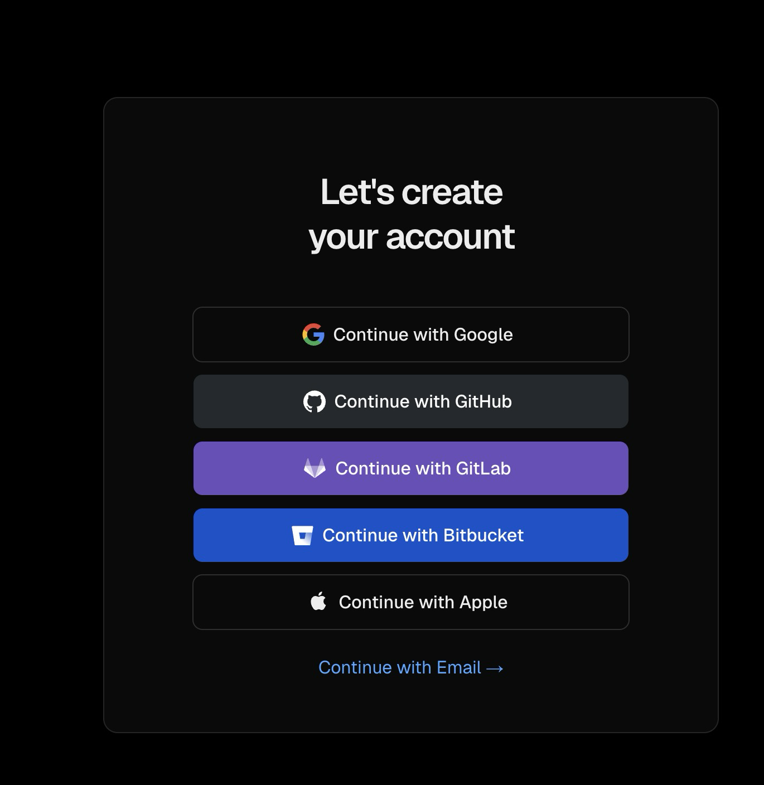

ורסל מעלה את האתרים שלכם לאוויר. כל פוש ל-GitHub מעלה אוטומטית.

## הרשמה

- נכנסים ל-<https://vercel.com/signup>
- בוחרים Hobby ומכניסים את שמכם
- נרשמים עם GitHub (מומלץ - מחבר אוטומטית)



נרשמים עם Github (מומלץ)



## התחברות

כותבים לקלוד קוד:

```text
חבר אותי ל-vercel
```

- הדפדפן נפתח, מאשרים את החיבור
