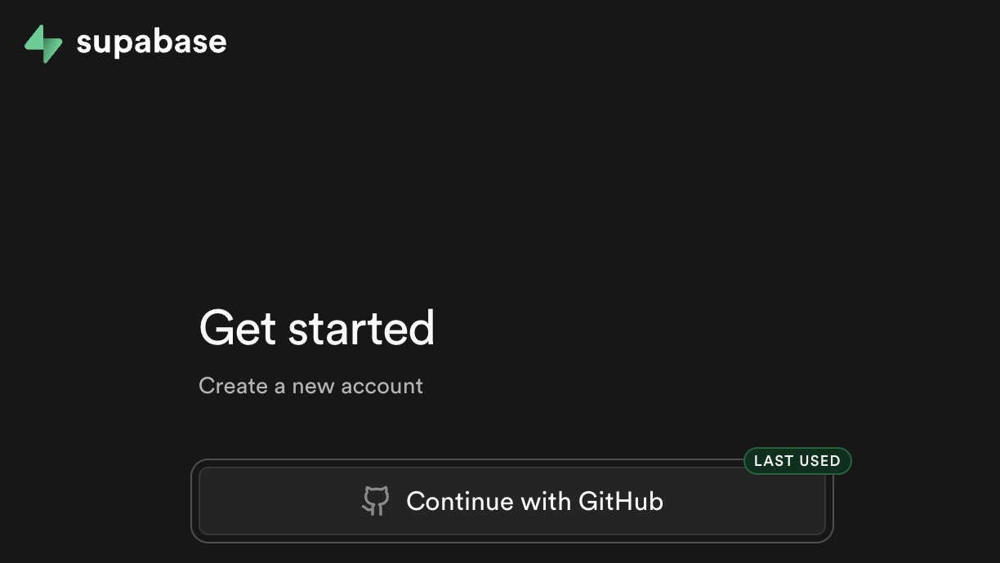
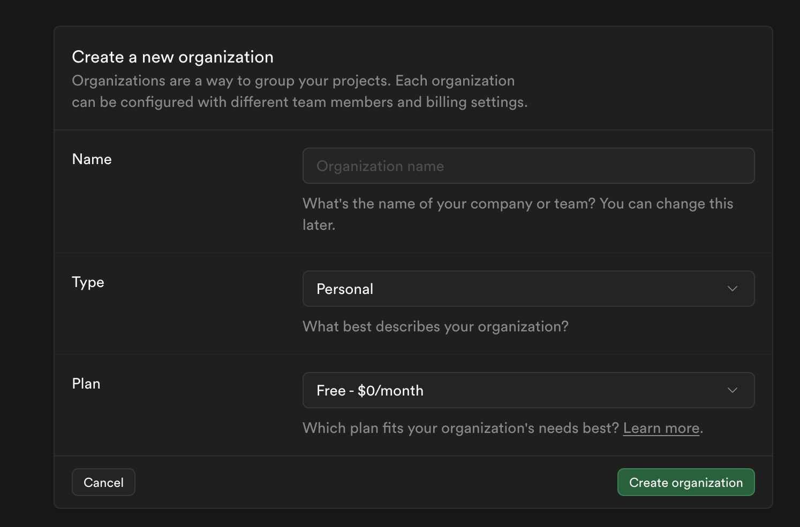
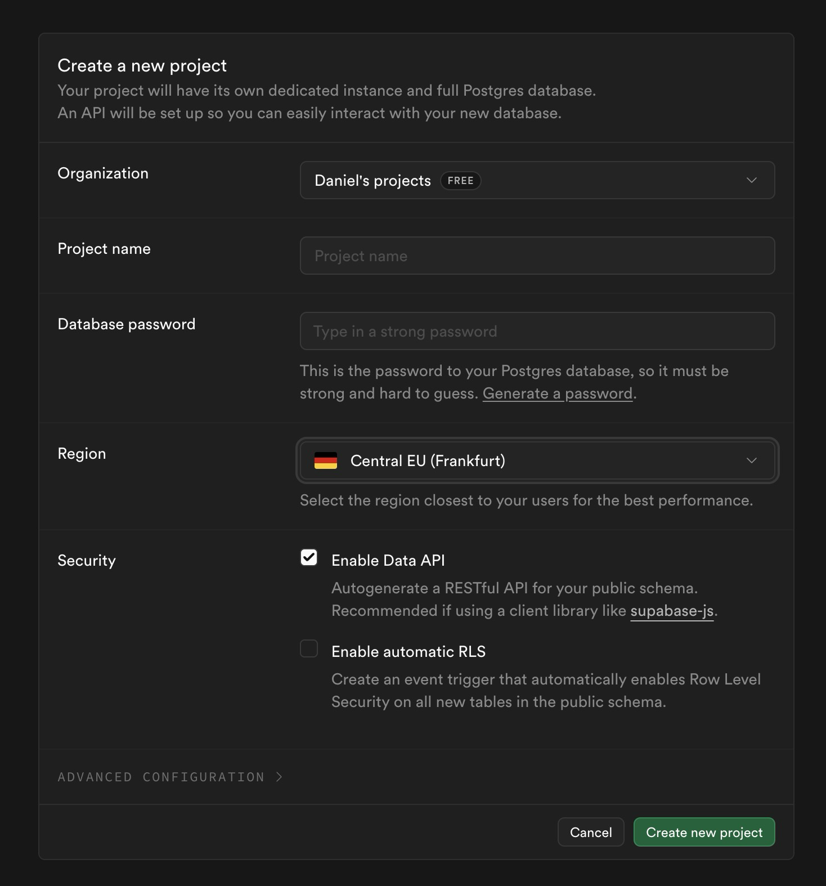

סופאבייס הוא הדאטאבייס שלכם. פה יישבו לקוחות, הזמנות, סטטיסטיקות.

## הרשמה

- נכנסים ל-<https://supabase.com/dashboard/sign-up>
- נרשמים עם GitHub



## יצירת ארגון

ממלאים את פרטי הארגון

- בוחרים Personal
- Plan - Free



## יצירת פרויקט

- לוחצים New Project
- שם: למשל my-business
- סיסמת דאטאבייס - לשמור!
- אזור: פרנקפורט או לונדון (הקרוב לישראל)
- ממתינים ~2 דקות



## התחברות

כותבים לקלוד קוד:

```text
חבר אותי ל-supabase
```

- עוקבים אחרי אימות בדפדפן
