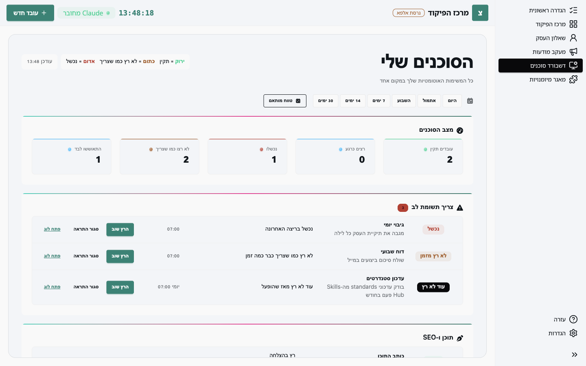

**דשבורד סוכנים** מרכז את כל המשימות האוטומטיות שלכם, כולל כאלה שרצות בלי שביקשתם, כמו לולאת הלמידה ועדכון התקנים החודשי, ומראה מה רץ כמו שצריך ומה לא.

## הצבעים

- **ירוק**: רץ בזמן והצליח.
- **כתום**: לא רץ כשהיה צריך, למשל כי המחשב היה כבוי.
- **אדום**: רץ ונכשל.
- **אפור**: עוד לא רץ מאז שהופעל.

## צריך תשומת לב

הרשימה הזו מציגה רק מה שדורש פעולה. לכל שורה: **הרץ שוב** מפעיל את המשימה עכשיו, **סגור התראה** מסתיר אותה עד הריצה הבאה, **פתח לוג** פותח את פלט הריצה האחרונה.

## טווח זמן

הכפתורים בראש המסך (היום, אתמול, השבוע, ועוד) משנים את התקופה של כל הסיכומים במסך.

## בגרסת האלפא

חלק מהנתונים במסך הזה נוצרים בעת פתיחת האפליקציה מקבצי היומן, כדי שהמסך ייראה חי גם לפני שהריצות האמיתיות הצטברו. אם משהו לא תואם למה שקרה בפועל, זו כנראה הסיבה, ונשמח לשמוע (ראו **מדריך לבודקי האלפא**).
