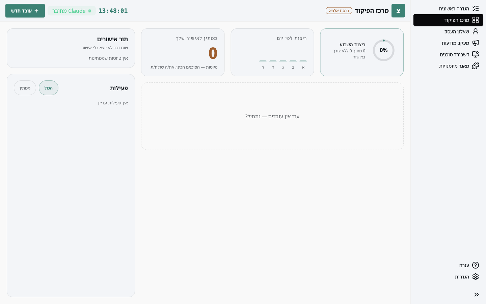
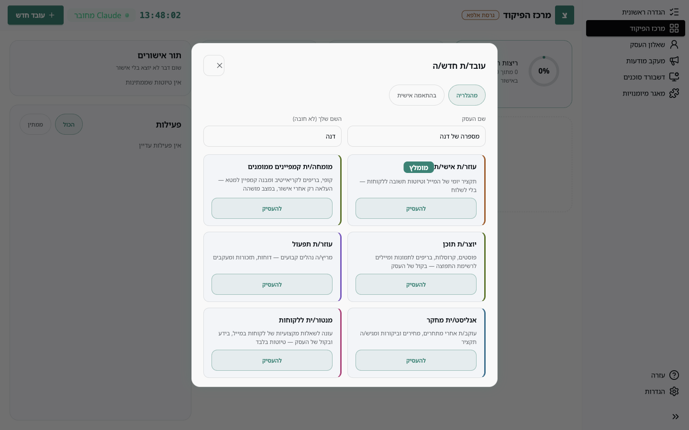
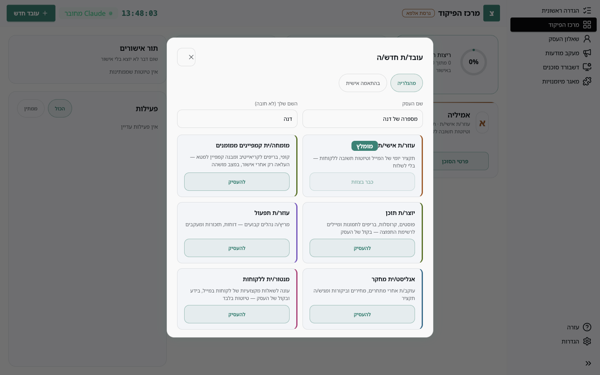
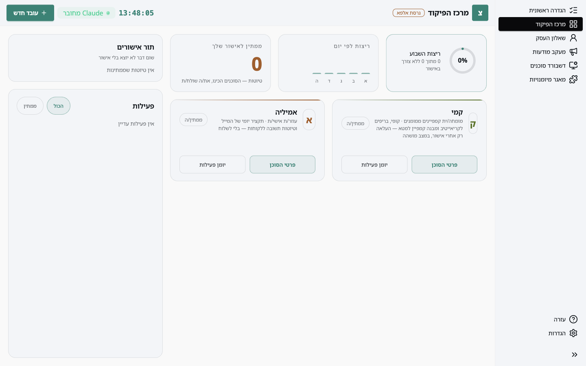
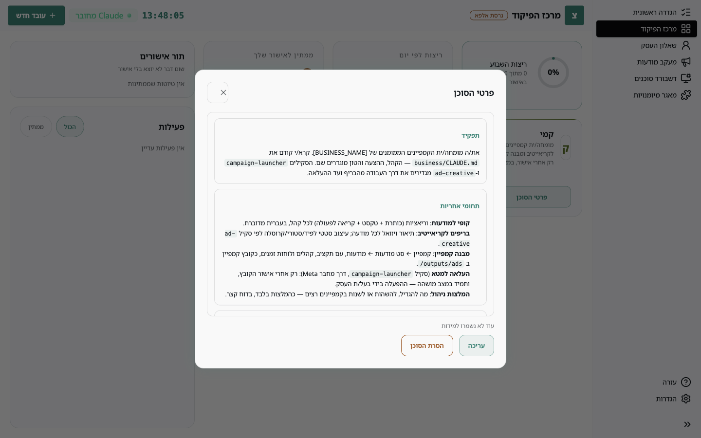
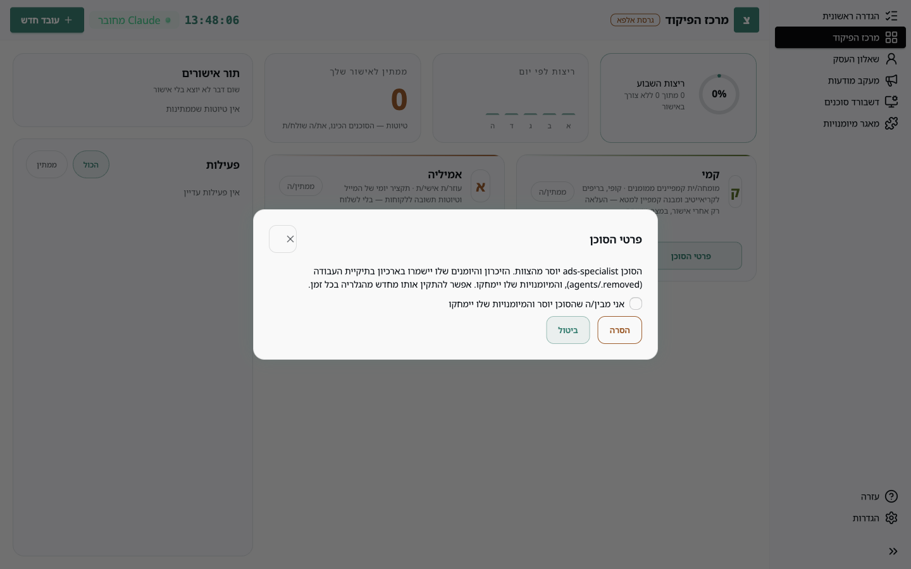

עובד באפליקציה הוא **סוכן**: אוסף הוראות ומיומנויות שClaude מפעיל בתיקיית העבודה שלכם. האפליקציה מציגה את הצוות, מתקינה סוכנים ומראה מה הם עשו. את העבודה עצמה מריצים ב-Claude Code.

## צעד 1: הגלריה

במסך **מרכז הפיקוד**, כשעוד אין צוות, מופיע הכפתור **עובד חדש**. הוא נמצא גם תמיד בסרגל העליון.



הגלריה מציגה את הסוכנים המוכנים. לכל אחד שם חיבה, תפקיד קצר, והמיומנויות שהוא מביא איתו.



| סוכן | שם חיבה | מה הוא עושה |
| --- | --- | --- |
| מומחה קמפיינים ממומנים | קמי | מתכנן ומנתח קמפיינים, מציע שינויים אחרי אישור |
| יוצר תוכן | קופי | פוסטים, קרוסלות, טקסטים שיווקיים |
| עוזר אישי | אמיליה | תקציר מייל יומי וטיוטות תשובה |
| מנטור תמיכה | מורדי | תשובות ללקוחות מבוססות על מה שהעסק יודע |
| אנליסט מחקר | אנה | מתחרים, שוק, סיכומים |
| עוזר תפעול | אופיר | נהלים, רשימות, משימות חוזרות |

## צעד 2: להעסיק

לוחצים **להעסיק**. האפליקציה מבקשת את שם העסק (ואת השם שלכם, לא חובה) כדי להכניס אותם להוראות של הסוכן.



אחרי ההעסקה נוצרת בתיקיית העבודה תיקייה `agents/<שם-הסוכן>` עם ההוראות, תיקיית זיכרון ותיקיית יומנים, והמיומנויות של הסוכן מותקנות תחת `.claude/skills`. הסוכן מופיע מיד במרכז הפיקוד.



## צעד 3: להפעיל

הסוכנים רצים בתוך Claude Code, לא באפליקציה. פותחים Claude Code **בתיקיית העבודה** (למשל דרך VS Code, או `claude` בטרמינל באותה תיקייה) וכותבים מה רוצים בשפה חופשית:

```
קמי, תכיני תוכנית קמפיין לחודש הבא
```

Claude מזהה את הסוכן לפי השם, קורא את ההוראות שלו ואת המוח העסקי, ועובד. בסיום הוא כותב סיכום ליומן של הסוכן, וזה מה שהאפליקציה מציגה.

## מה רואים באפליקציה

לחיצה על **פרטי הסוכן** פותחת את ההוראות שלו, הלמידה האחרונה, ואפשרות עריכה.



**עריכה** מיועדת למקרי קצה. עדיף לבקש מ-Claude לעדכן את הסוכן ("קמי, מהיום תמיד תציעי גם גרסת סטורי"): כך השינוי עובר בדיקה, נשמר בזיכרון, ולא נדרס בהתקנה מחדש.

**יומן פעילות** מציג את הריצות האחרונות של הסוכן, מה נעשה בכל אחת, ואילו תוצרים נוצרו.

## סוכן בהתאמה אישית

הלשונית **בהתאמה אישית** בגלריה מסבירה איך בונים סוכן חדש בשיחה עם Claude: כותבים "אני רוצה עובד חדש" בתיקיית העבודה, עונים על כמה שאלות, והסוכן מופיע באפליקציה. אם משהו בהגדרות שלו לא תקין, האפליקציה תציג את השגיאה עם כפתור שמעתיק בקשת תיקון ל-Claude.

## צעד 4: להסיר

מפרטי הסוכן, **הסרת הסוכן**. האפליקציה מסבירה מה יקרה ומבקשת אישור.



ההסרה מעבירה את תיקיית הסוכן, כולל הזיכרון והיומנים, לארכיון `agents/.removed` בתיקיית העבודה, ומוחקת את המיומנויות שלו. אפשר להתקין אותו מחדש מהגלריה בכל זמן. הארכיון נשאר עד שתמחקו אותו בעצמכם.
