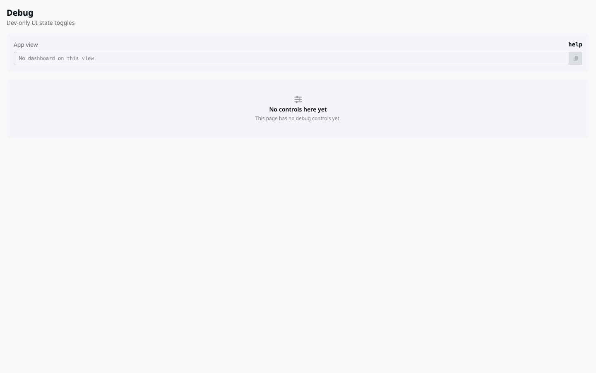
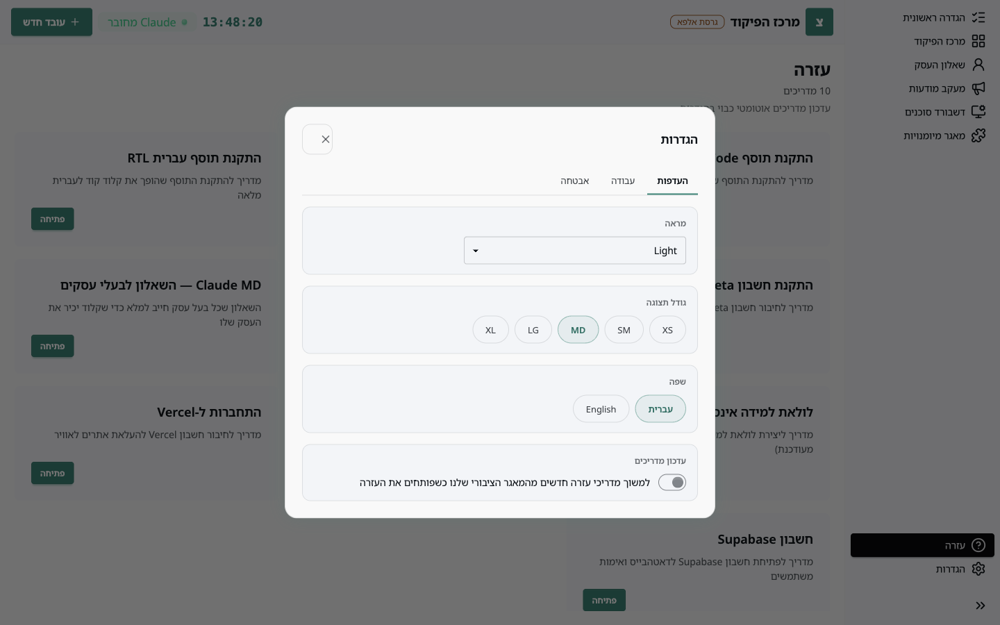
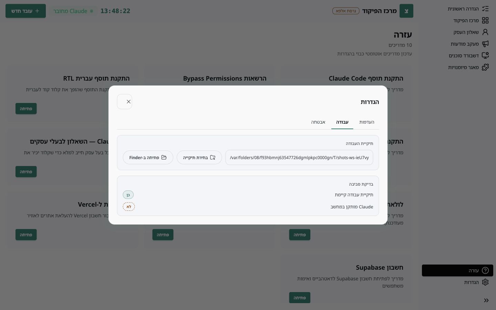

תודה שאתם בודקים. גרסת האלפא היא הגרסה המלאה עם כמה כלים נוספים לבדיקה, והתג **גרסת אלפא** בסרגל העליון מזכיר את זה.

## מה מצפים מכם

- להשתמש כמו בעל עסק: לעבור את ההגדרה הראשונית, להעסיק סוכן, לעבוד איתו כמה ימים.
- לרשום כל דבר שלא היה ברור, לא עבד, או הפתיע. גם דברים קטנים.
- לא לתקן בעצמכם קבצים בתיקיית העבודה. אם משהו שבור, נרצה לראות אותו שבור.

## חלון הדיבאג

לחיצה על **Ctrl+Shift+D** (בווינדוס) או **Cmd+Shift+D** (במק), מכל מקום באפליקציה, פותחת חלון קטן בשם Debug.

החלון מציג באיזה מסך האפליקציה נמצאת, ובמסכים מסוימים מציע מתגים שמדמים מצבים: למשל "כל הסוכנים נכשלו" בדשבורד הסוכנים, או מצבי התחברות שונים במעקב מודעות. המתגים משנים רק את התצוגה, לא את הקבצים. כשהחלון סגור, הכול חוזר לרגיל.

## הגדרות שכדאי להכיר

- **מראה** ו**גודל תצוגה**: אם משהו נראה חתוך או קטן, נסו גודל אחר ודווחו מה השתנה.
- **שפה**: עברית ואנגלית. תרגומים חסרים באנגלית הם דיווח לגיטימי.
- **עדכון מדריכים**: כבוי = המדריכים שהגיעו עם הגרסה בלבד.

בלשונית **עבודה** רואים את תיקיית העבודה הנוכחית ואת בדיקת הסביבה: האם התיקייה קיימת והאם Claude מותקן.

## איך מדווחים

הכי עוזר לנו דיווח עם ארבעה דברים:

1. **מה עשיתם**, צעד אחרי צעד, כולל מה כתבתם ל-Claude.
2. **מה ציפיתם** שיקרה.
3. **מה קרה** בפועל. צילום מסך של האפליקציה שווה הרבה.
4. **מערכת ההפעלה** וגרסתה.

אם הבעיה קשורה לסוכן, צרפו את הסיכום מיומן הפעילות שלו (פרטי הסוכן ← יומן פעילות). אם הבעיה קשורה ללולאת הלמידה, צרפו את `self_learn.log` (ראו **לולאת הלמידה**).

## מה ידוע ולא צריך לדווח

- החיבורים ל-Meta ולרב מסר נבדקים בימים אלה על ידי הצוות; אם משהו שם לא עובד, נשמח לשמוע, אבל זה לא הפתעה.
- דשבורד הסוכנים מציג נתוני הדגמה עד שהריצות האמיתיות מצטברות.
- בהתקנה בווינדוס SmartScreen מזהיר על מפרסם לא מזוהה, ובמק Gatekeeper מבקש אישור. זה צפוי בגרסת האלפא, שעדיין לא חתומה.
