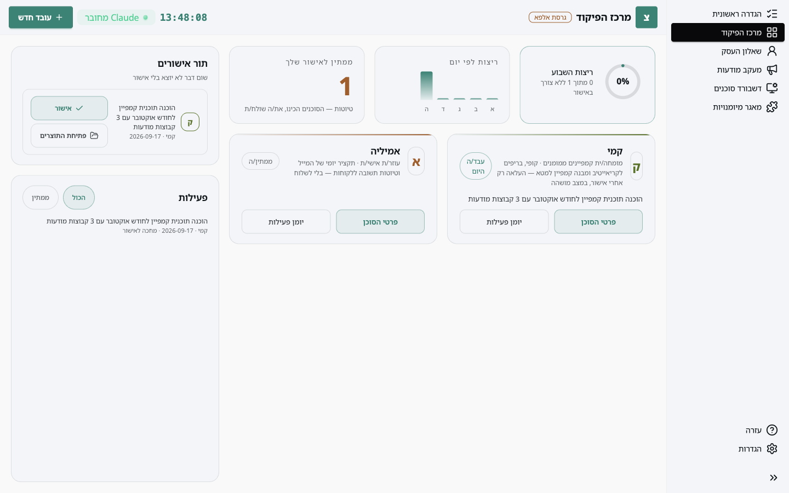
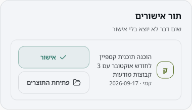

כל סוכן שמגיע עם האפליקציה עובד במצב **טיוטה בלבד**: הוא מכין, ואתם שולחים. מייל ללקוח, פוסט, שינוי בקמפיין: הסוכן כותב את זה כתוצר, מסמן שנדרש אישור, ועוצר.

## איפה זה מופיע

במרכז הפיקוד, בעמודה הצדדית, יש **תור אישורים**. כל ריצה שסומנה כדורשת אישור מופיעה בו עם שם הסוכן, תיאור קצר ותאריך.

הכרטיס בראש המסך, **ממתין לאישור שלך**, סופר כמה כאלה יש.

## צעד 1: לבדוק את התוצר

**פתיחת התוצרים** פותח את התיקייה עם מה שהסוכן הכין. קוראים, ואם צריך תיקון, אומרים לסוכן ב-Claude Code מה לשנות. הוא יכין גרסה חדשה וזו תופיע בתור במקום הקודמת.

## צעד 2: לאשר

לחיצה על **אישור** מסמנת את הריצה כמאושרת: האפליקציה כותבת "אושר" ליומן של הסוכן, והכרטיס עובר למצב מאושר.

מה קורה אחרי האישור תלוי בסוג התוצר. טיוטות מייל נשלחות **מהחשבון שלכם** כשאתם מבקשים מהסוכן לשלוח, או שולחים בעצמכם. הסוכנים לא שולחים שום דבר החוצה מעצמם, גם אחרי אישור.

## למה זה בנוי ככה

- אתם רואים כל דבר לפני שהוא יוצא, בזמן שנוח לכם.
- טעות של סוכן נעצרת אצלכם, לא אצל לקוח.
- היומן שומר מי הכין מה, ומתי אושר.

## שאלות נפוצות

**האישור לא מופיע בתור.** הסוכן מסמן אישור בשורה "דורש אישור: כן" בסיכום הריצה שלו. אם הוא כתב "לא", הריצה מופיעה ביומן הפעילות בלבד. אפשר לבקש ממנו לסמן מחדש.

**יש יותר משלושה אישורים.** התור מציג את הראשונים ומספר כמה עוד ממתינים. מאשרים אחד, והבא עולה.

**אישרתי בטעות.** האישור הוא סימון ביומן, לא פעולה החוצה. אמרו לסוכן לא לשלוח, או פשוט אל תבקשו ממנו לשלוח.
