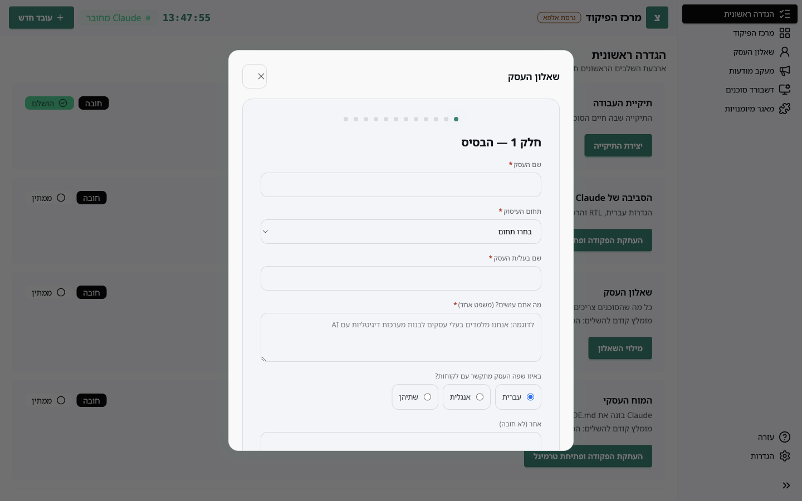
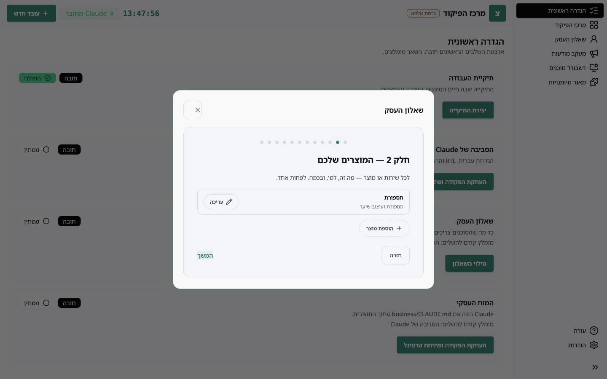
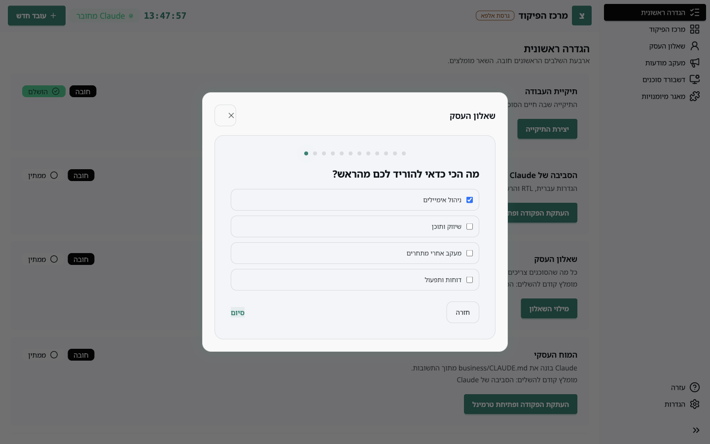
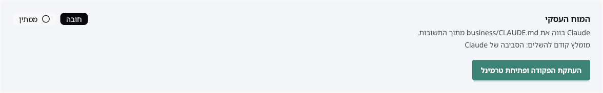

הסוכנים לא יודעים כלום על העסק שלכם עד שאתם מספרים להם. הסיפור הזה חי בשני מקומות: **השאלון** שאתם ממלאים באפליקציה, ו**המוח העסקי** שClaude בונה מהתשובות. כל סוכן קורא את המוח לפני כל משימה.

## צעד 1: מילוי השאלון

פותחים את השאלון מכפתור **מילוי השאלון** במסך ההגדרה הראשונית, או מ**שאלון העסק** בתפריט הצד.

השאלון מחולק לעשרה חלקים קצרים. חמשת הראשונים חובה:

1. **הבסיס**: שם העסק, תחום, מה אתם עושים במשפט אחד.
2. **המוצרים שלכם**: מוצר או שירות, מה הוא, ומחיר. אפשר להוסיף כמה שרוצים.
3. **קהל היעד**: מי הלקוח האידיאלי ומה כואב לו.
4. **הקול שלכם**: הטון, משפטים לדוגמה, איך אתם חותמים.
5. **כללי ברזל**: דברים שאסור לסוכן לעשות או להבטיח לעולם.

חלקים 6 עד 10 הם טקסט חופשי, ואפשר להמשיך הלאה בלי למלא. בסוף יש מסך פרטים נוספים (אפשר לדלג) ומסך אחרון ששואל מה הכי כדאי להוריד לכם מהראש.

לחיצה על **סיום** שומרת את התשובות ב-`business/answers.json` בתיקיית העבודה, ושורת השאלון מסומנת "הושלם".

## צעד 2: בניית המוח

לוחצים **העתקת הפקודה ופתיחת טרמינל**, מדביקים, ו-Enter. Claude קורא את התשובות וכותב את `business/CLAUDE.md`: תיאור העסק, המוצרים, הקהל, הטון והכללים, מנוסחים כהוראות לסוכנים. זה לוקח דקה או שתיים.

כשהקובץ נכתב, השורה משתנה ל"הושלם" מעצמה.

## צעד 3: עדכון תשובות

כשמשהו בעסק משתנה, חוזרים לשאלון (הכפתור נקרא עכשיו **עדכון התשובות**), משנים מה שצריך, ולוחצים **שמירה** פעם אחת בסוף. האפליקציה משווה את התשובות החדשות למה שהמוח נבנה ממנו, ורושמת רק את ההבדלים.

מרגע השמירה תופיע שורה בראש המסך: התשובות השתנו מאז הבנייה האחרונה. הבנייה מחדש עובדת בדיוק כמו הראשונה, אבל Claude מעדכן רק את החלקים שהשתנו ולא מוחק דברים שהוספתם בעצמכם לקובץ.

> 📷 **צילום מסך חסר:** השורה הכתומה "התשובות השתנו מאז הבנייה האחרונה" בראש מסך ההגדרה, אחרי עריכת תשובה.

## מה נמצא איפה

| קובץ בתיקיית העבודה | מה זה |
| --- | --- |
| `business/answers.json` | התשובות שלכם, כפי שנשמרו מהשאלון |
| `business/CLAUDE.md` | המוח: ההוראות שהסוכנים קוראים |
| `business/answers-changes.md` | רשימת השינויים שעוד לא נבנו, נמחקת אחרי בנייה |

אפשר לפתוח את `business/CLAUDE.md` ולקרוא. עדיף לא לערוך אותו ידנית: שינוי בשאלון ובנייה מחדש שומרים על הסדר, עריכה ידנית עלולה להידרס.
