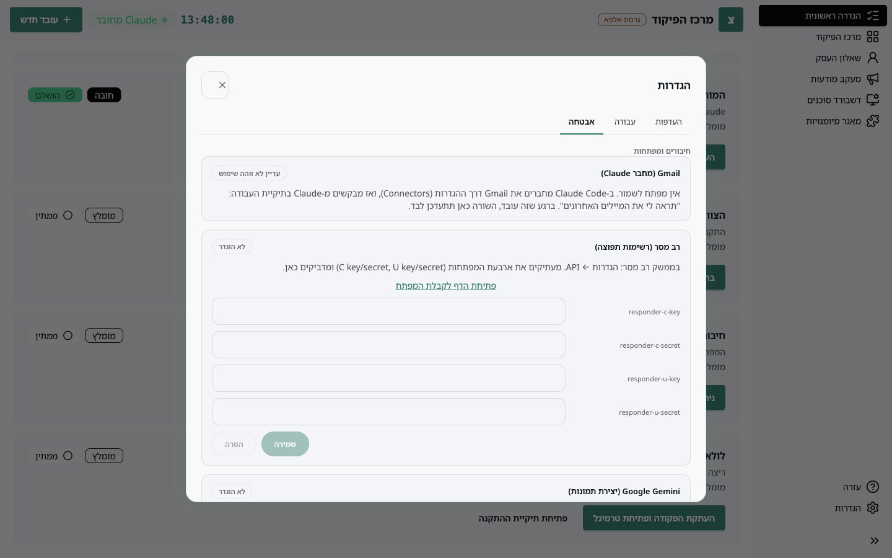

חלק מהסוכנים צריכים גישה לשירות חיצוני: תיבת המייל, מערכת הדיוור, חשבון המודעות. שורת **חיבורים** במסך ההגדרה הראשונית מציגה רק את מה שהצוות שהתקנתם באמת צריך, ומי צריך את זה.

## איפה מנהלים

**ניהול חיבורים** (משורת החיבורים) או **הגדרות ← אבטחה** פותחים את אותו מסך.

לכל שירות יש כרטיס עם המצב שלו: **שמור** כשמפתח הודבק, **לא הוגדר** כשלא, ובמקרה של Gmail, מתי Claude השתמש בו לאחרונה.

## איפה המפתחות נשמרים

מפתחות שאתם מדביקים נשמרים ב**מחזיק המפתחות של מערכת ההפעלה** (Keychain במק, Credential Manager בווינדוס), לא בקובץ בתיקיית העבודה. כך גיבוי או שיתוף של התיקייה לא חושף אותם. הסוכנים קוראים אותם משם דרך שרתי ה-MCP שלהם.

## Gmail (דרך Claude)

אין מה להדביק. Gmail מחובר ל-Claude עצמו, דרך ההגדרות של Claude (Connectors), ולא לאפליקציה. אחרי החיבור:

1. פותחים Claude Code בתיקיית העבודה.
2. מבקשים משהו שמשתמש במייל, למשל "תראה לי את המיילים האחרונים".
3. ברגע שClaude קורא מהמייל, האפליקציה מזהה זאת (דרך רישום שהסוכנים כותבים לתיקיית העבודה) ומסמנת את Gmail כמחובר.

הכרטיס יציג "Claude השתמש ב-..." עם הזמן האחרון. אם הוא מציג "עדיין לא זוהה שימוש", פשוט עוד לא ביקשתם כלום מהמייל.

## רב מסר (רשימות תפוצה)

נדרש לסוכני דיוור, למשל שליחת ניוזלטר.

1. **פתיחת הדף לקבלת המפתח** פותח את responder.co.il בדפדפן.
2. בממשק רב מסר: **הגדרות ← API**. יש שם ארבעה מפתחות: C key, C secret, U key, U secret.
3. מעתיקים כל אחד לשדה המתאים באפליקציה ולוחצים **שמירה**.

> 📷 **צילום מסך חסר:** מסך ה-API בממשק רב מסר עם ארבעת המפתחות (לטשטש את הערכים).

הסוכן ישלח מייל בדיקה לכתובת שלכם לפני כל שליחה לרשימה, ויבקש אישור מפורש עם גודל הרשימה.

## מודעות Meta (קמפיינים)

נדרש לדשבורד מעקב המודעות ולסוכן הקמפיינים. צריך **טוקן משתמש מערכת** שלא פג תוקף. המדריך **הקמת חשבון Meta** מסביר את התהליך צעד אחר צעד.

יש שתי דרכים לחבר: להדביק את הטוקן בכרטיס Meta כאן, או להתחבר דרך דשבורד המודעות. שתיהן מגיעות לאותו מקום, והדשבורד מתחבר אוטומטית.

**ניתוק**: הכפתור **הסרה** בכרטיס Meta מנתק גם את הדשבורד ומוחק את קובץ הטוקן המקומי. האפליקציה תבקש אישור.

## Google Gemini (יצירת תמונות)

נדרש רק אם רוצים שהקרוסלות והמודעות יקבלו תמונות שנוצרות ב-AI. בלי מפתח הכול עובד כטקסט ועיצוב. ראו **מפתח Gemini**.

## SEO (Search Console, Analytics, WordPress)

סיסמת האפליקציה של וורדפרס מדביקים כאן (ראו **חיבור לוורדפרס**). את חיבור Google עושים מתוך לשונית SEO בדשבורד המודעות, כי הוא דורש התחברות בדפדפן.

## החלפה והסרה

כשמפתח שמור, השדה מציג "שמור — הדביקו כדי להחליף". הדבקה חדשה ושמירה מחליפות. **הסרה** מוחקת את המפתח ממחזיק המפתחות.
