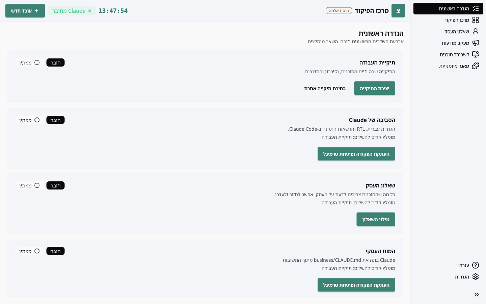
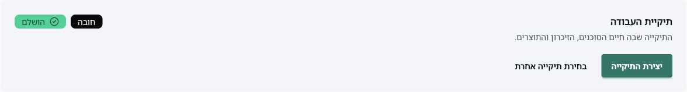
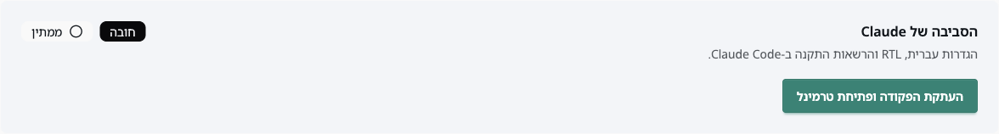
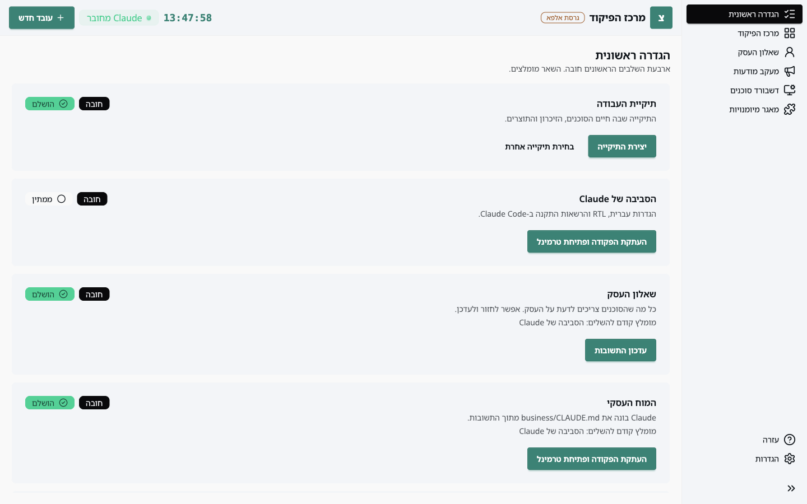
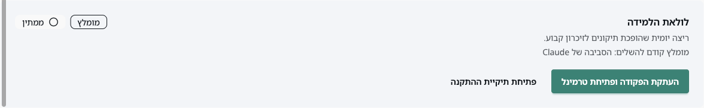
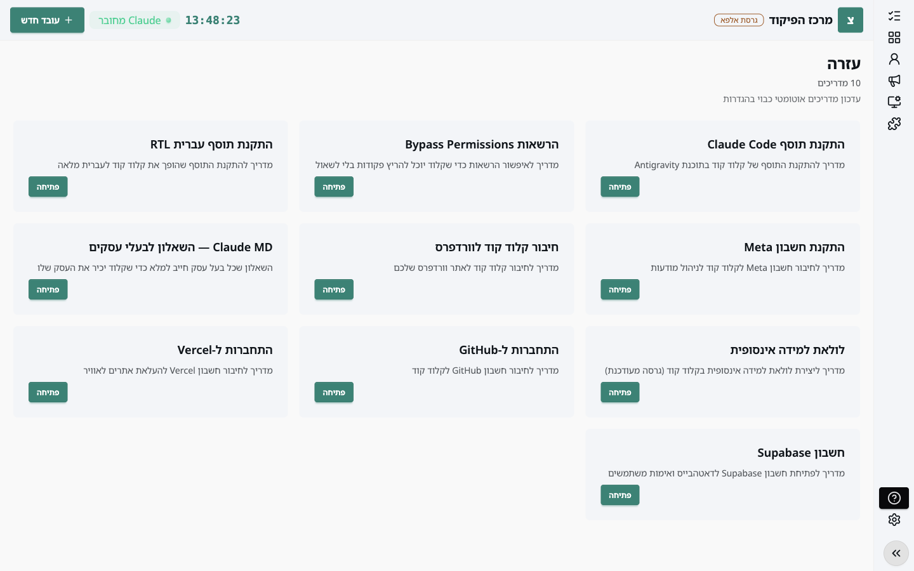

כשפותחים את האפליקציה בפעם הראשונה היא נפתחת על מסך **הגדרה ראשונית**. המסך הזה לא שומר שום דבר בעצמו: כל שורה בו בודקת מה קיים בפועל בתיקיית העבודה שלכם, ומסמנת "הושלם" רק כשהקבצים באמת שם. אפשר לחזור אליו בכל זמן דרך התפריט בצד.

ארבע השורות הראשונות הן **חובה**. שלוש האחרונות **מומלצות**, ואפשר להשלים אותן בהמשך.

## צעד 1: תיקיית העבודה

תיקיית העבודה היא המקום שבו חיים העובדים (הסוכנים), הזיכרון שלהם והתוצרים. ברירת המחדל היא תיקייה בשם `AgenticOS` בתיקיית הבית שלכם.

- **יצירת התיקייה** יוצרת אותה עם כל מה שהסוכנים צריכים: תיקיית `business`, תיקיית `agents`, ההוראות הבסיסיות של Claude, ותיקיית לולאת הלמידה.
- **בחירת תיקייה אחרת** מאפשרת להשתמש בתיקייה קיימת, למשל אם אתם מנהלים יותר מעסק אחד.

## צעד 2: הסביבה של Claude

השורה הזו מגדירה את Claude Code כך שיעבוד בעברית, יציג טקסט מימין לשמאל, ויידע אילו התקנות מותר לו לבצע בלי לשאול בכל פעם.

לחיצה על **העתקת הפקודה ופתיחת טרמינל** עושה שני דברים: מעתיקה ללוח את הפקודה `claude "הגדר/י לי את הסביבה — הפעל את golem-setup"` ופותחת טרמינל בתיקיית העבודה. מדביקים את הפקודה (Cmd+V במק, Ctrl+V בווינדוס) ולוחצים Enter. Claude ידריך אתכם דרך שלושת השלבים: הוראות בסיס בעברית, תוסף ה-RTL לעורך, והרשאות ההתקנה.

**בווינדוס** ייתכן שהפקודה הראשונה תיכשל עם הודעה על `execution policy`. זה תיקון חד-פעמי, ראו במדריך **פתרון בעיות**.

השורה מסומנת "הושלם" כשקובץ ההגדרות של Claude בתיקיית העבודה מכיל את ההגדרות האלה.

## צעד 3: שאלון העסק

**מילוי השאלון** פותח שאלון של עשרה חלקים קצרים על העסק: מה אתם עושים, למי, באיזה טון, ומה אסור. התשובות נשמרות בתיקיית העבודה ב-`business/answers.json`. אפשר לחזור ולעדכן אותן בכל זמן, וגם דרך הכפתור **שאלון העסק** בתפריט הצד.

המדריך **המוח העסקי** מסביר מה קורה עם התשובות.

## צעד 4: המוח העסקי

מתוך התשובות Claude כותב קובץ אחד, `business/CLAUDE.md`, שכל סוכן קורא לפני כל משימה. גם כאן הכפתור מעתיק פקודה ופותח טרמינל, ואתם מדביקים ולוחצים Enter.

אם תשנו תשובות בשאלון אחרי הבנייה, השורה תציג "לא מעודכן" והמלצה לבנות מחדש. הבנייה מחדש מעדכנת רק את החלקים שהשתנו.

## צעד 5: הצוות

**בחירת סוכנים** פותח את הגלריה. מספיק סוכן אחד כדי שהשורה תושלם. המדריך **עובדים** מסביר את כל התהליך.

## צעד 6: חיבורים

השורה הזו משתנה לפי הצוות: היא מציגה רק את המפתחות והחיבורים שהסוכנים שהתקנתם באמת צריכים. חיבור Gmail מזוהה אוטומטית אחרי השימוש הראשון של Claude בו; מפתחות כמו רב מסר מדביקים פעם אחת. ראו **חיבורים ומפתחות**.

## צעד 7: לולאת הלמידה

ריצה יומית שהופכת תיקונים שנתתם לסוכנים בשיחה לזיכרון קבוע. גם כאן: העתקת פקודה, הדבקה בטרמינל, ו-Claude מתקין. **פתיחת תיקיית ההתקנה** פותחת את התיקייה עם הקבצים, למי שרוצה לראות מה מותקן. פרטים במדריך **לולאת הלמידה**.

## טיפים

- **התפריט בצד מתקפל.** הכפתור בתחתית מקטין אותו לאייקונים בלבד, וריחוף מעל אייקון מציג את השם.

- **המסך מתעדכן לבד.** האפליקציה עוקבת אחרי תיקיית העבודה. כשClaude מסיים לכתוב קובץ, השורה המתאימה משתנה תוך שניות, בלי לרענן.
- **הפקודות בטוחות להעתקה.** כל כפתור "העתקת הפקודה" מעתיק פקודת `claude` אחת. אין צורך להקליד שום דבר בעצמכם.
