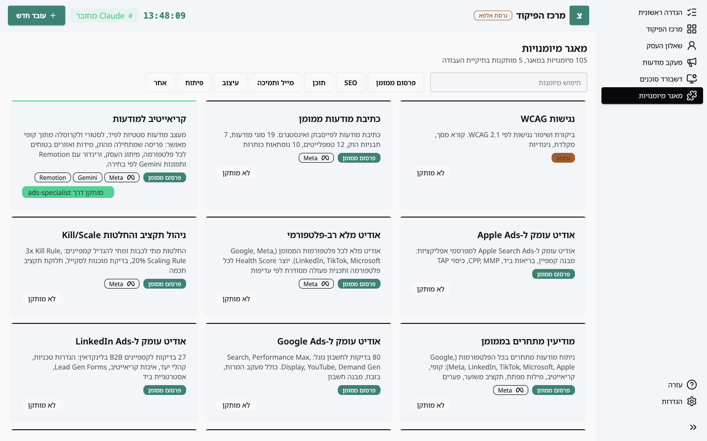
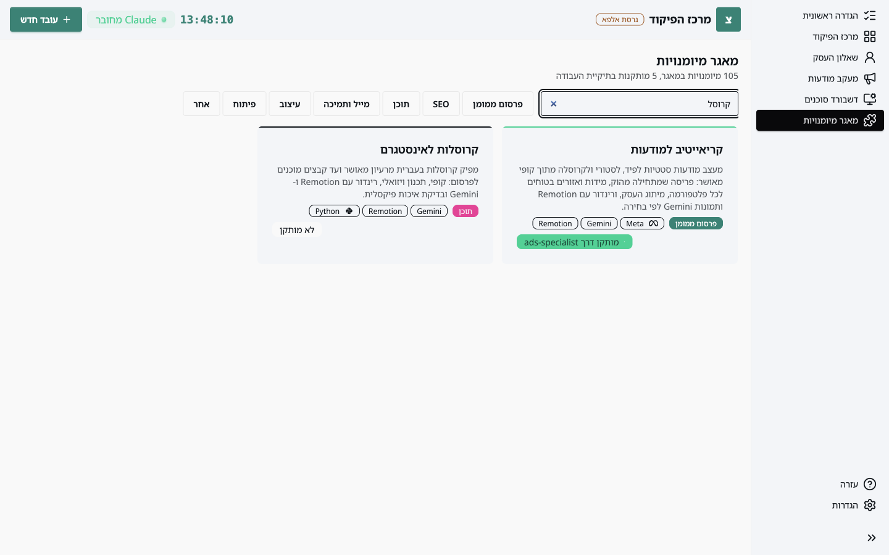

**מיומנות** היא הוראות מוכנות למשימה מסוימת: אודיט לחשבון מודעות, כתיבת קרוסלה, סיכום תיבת מייל. הסוכנים מגיעים עם המיומנויות שהם צריכים, והמאגר מציג את כל מה שקיים.

## המסך



בראש המסך: כמה מיומנויות יש במאגר וכמה מהן מותקנות בתיקיית העבודה שלכם. מתחת, חיפוש חופשי וסינון לפי קטגוריה. כל כרטיס מציג את שם המיומנות, מה היא עושה, קטגוריה (צבע לכל קטגוריה), הכלים שהיא צריכה (Meta, Gmail, Gemini וכדומה), ומצב התקנה.



## מצבי התקנה

- **מותקן דרך <סוכן>**: המיומנות הגיעה עם סוכן שהעסקתם. היא תוסר יחד איתו.
- **מותקן**: המיומנות הותקנה בפני עצמה, לא דרך סוכן.
- **לא מותקן**: קיימת במאגר, לא בתיקיית העבודה.

## איך מתקינים מיומנות בודדת

בגרסת האלפא ההתקנה נעשית דרך Claude, לא מכפתור. פותחים Claude Code בתיקיית העבודה וכותבים:

```
תתקין לי את המיומנות web-perf מה-Skills Hub
```

Claude יודע איפה המאגר (הכתובת מוגדרת בשלב "הסביבה של Claude") ומותר לו להתקין ממנו בלי לשאול. אחרי ההתקנה המיומנות תופיע כ"מותקן" במסך הזה.

## מה הכלים אומרים

תג כלי על כרטיס אומר שהמיומנות תעבוד רק אם החיבור המתאים קיים: **Meta** צריך טוקן, **Gmail** צריך את חיבור Claude, **Gemini** צריך מפתח, **Remotion** ו-**Python** צריכים התקנה במחשב שהסוכן ידריך בה. ראו **חיבורים ומפתחות**.

## עדכונים

מיומנות שהותקנה שייכת לכם: המאגר לא משנה אותה בעצמו. יוצא מן הכלל אחד הוא קבצי התקנים של הפרסום הממומן, שהסוכן מעדכן פעם בחודש ממקור מאומת.
